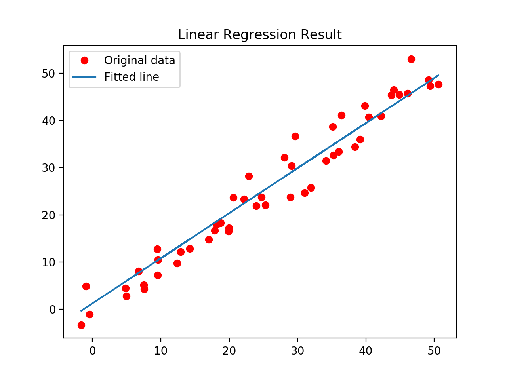
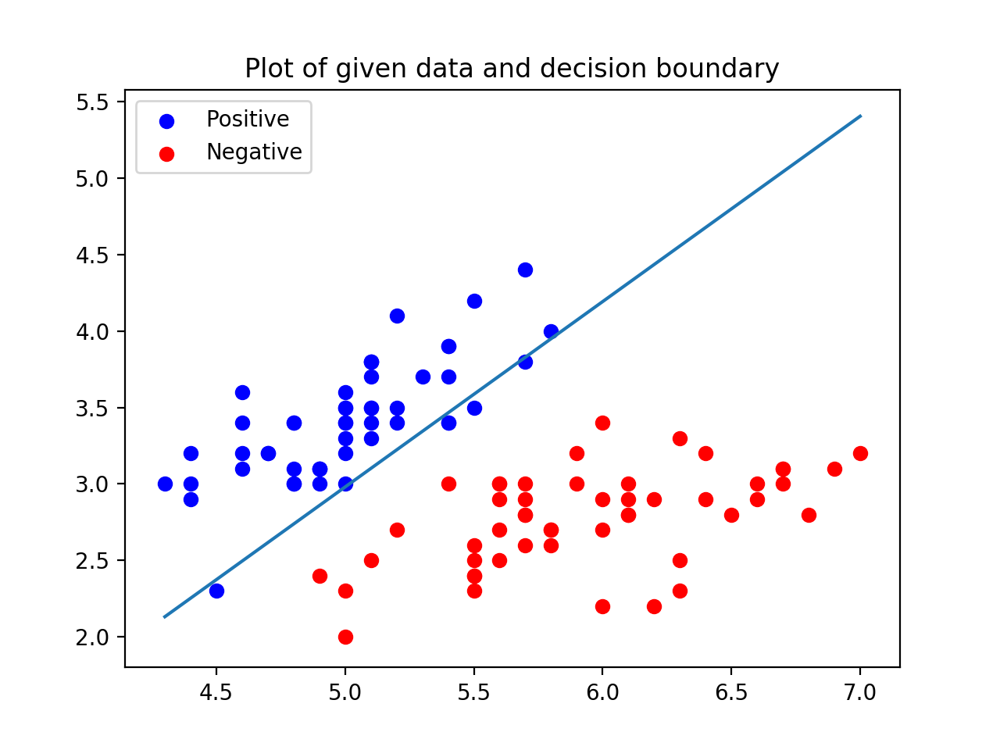

# Regression Analysis

Regression analysis is a predictive modeling technique which investigates the relationship among variables. It aims to find the **_causal effect relationship_** between a dependent variable ('target' or 'label') and one or more indenpendent variables ('predictors').

Regression analysis is an important tool for analyzing data. Here, we fit a curve to the data points, while the difference between the distaces of data points from the curve is mimimized (try to make the curve as close as possible to the original data points).

Below is an example of how regression used among stock analysis.


By using the regression analysis, two main insights can be observed:

* The relationships between dependent variable and independent variable.
* The strength of impact of multiple independent variables on the dependent variable.

Regression analysis also allows us to compare the effects of variables measured on different scales, such as the BMI and body weights. In that case, one can also use regression analysis to select the best set of variables used for building predictive models.

## Regression Models

* [Linear Regression](#Linear-Regression)
* [Logistic Regression](#Logistic-Regression)
* [Ridge Regression](#Ridge-Regression)
* [LASSO Regression](#LASSO-Regression)

----
### Linear Regression

The code can be find in [Python Code](./code/LinearRegression.py) (implemented using TensorFlow). Below is a brief summary of Linear Regression. For more details, please check:
* [Linear Regression - Wikipedia](https://en.wikipedia.org/wiki/Linear_regression)
* [Linear Regression Implementation - GeeksforGeeks](https://www.geeksforgeeks.org/linear-regression-python-implementation/)

Linear Regression might be the most popular statistical models in regression analysis. It allows us to learn a function which can represent the relationship between some data points _x_ and corresponding _y_. Such function/relationship is also called hypothesis.
```
h(x) = W*x + b
```
where _W_ is the parameter of weights (vector) and _b_ is the parameter of bias (scalar). All we need to do next is to estimate the value of _W_ and _b_ from the give data such that the hypothesis _h(x)_ is as close as possible to the original data point _y_. Therefore, the loss/cost function is introduced.

```
J(W, b) = sum(y - h(x))^2/n
```

where _n_ is the number of data points in the given dataset. This cost function is also called **Mean Squared Error**.

For finding the optimized value of the parameters for which J is minimum, a commonly used optimizer algorithm, **Gradient Descent** can be used here. Following is the pseudo-code for Gradient Descent:

```
Repeat untill Convergence {
  w = w - α * δJ/δw
  b = b - α * δJ/δb
}
```

where _α_ is a hyperparameter called the **Learning Rate**. Below is an example of how linear regression fitted among the original 2D data.



### Logistic Regression

The code can be find in [Python Code](./code/LogisticRegression.py) (implemented using TensorFlow). Below is a brief summary of Logistic Regression. For more details, please check:
* [Logistic Regression - Wikipedia](https://en.wikipedia.org/wiki/Logistic_regression)
* [Logistic Regression Implementation - GeeksforGeeks](https://www.geeksforgeeks.org/ml-logistic-regression-using-tensorflow/)

Logistic Regression is widely used in classification problem. When using binary logistic regression model, one can get the probability of label=True/1 and label=False/0. The logtistic function is a sigmoid function, which takes any real input _x_ and outputs a value _y_ between 0 and 1. The standard logtistic function is defined as follows: 
```
p(x) = 1/(1+exp(-x))
```
Using the same hypothesis function as Linear Regression, we can get the general logistic hypothesis as:
```
p(Y = 1|x) = exp(W*x + b)/(1+ exp(W*x + b)) = 1/(1+ exp(-W*x-b))
p(Y = 0|x) = 1/(1+ exp(W*x + b))
```
where _W_ is the parameter of weights (vector) and _b_ is the parameter of bias (scalar). _p(x)_ here is interpreted as the probability of independent variable _x_ falls between 0 and 1.

For multinomial logistic regression, the hypothesis can be written as:

```
p(Y = k|x) = exp(W_k*x+b)/(1+ SUM^{K-1}{exp(W_i*x+b)}) 
p(Y = K|x) = 1 /(1+ SUM^{K-1}{exp(W_i*x+b)}) 
```
where _k_ ranged from 1 to _K_.

Using the same optimization approach **Gradient Descent**, we can get the classifier. Below is an example of how logistic regression used among classification problem (data used: Iris.)



### Ridge Regression

### LASSO Regression

## Summary
