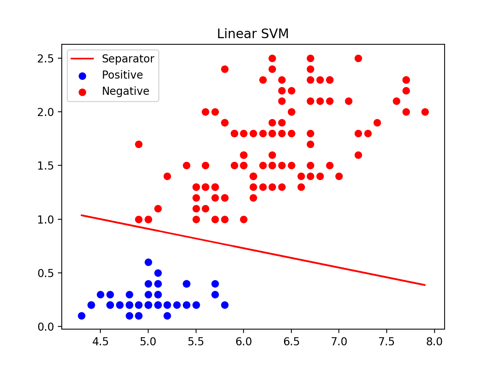
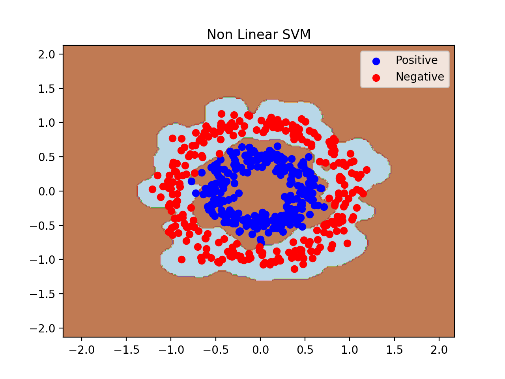

# Support Vector Machine

In Machine Learning area, Support Vector Machine (SVM) is one of the most important supervised learning methods that analyze data for classification. It aims to find a **_hyperplane_** which can seperate data into different regions. 

When data is linearly separable, SVM is simplified to **Linear Classification**. When data is not linearly separable, **kernel trick** is used to project data points to a higher dimensional space such that the data is "linear separable". Below is a simple explanation of how kernel works.


Below are some good references for SVM with detailed explanation and derivation.
* [Support Vector Machine - Wikipedia](https://en.wikipedia.org/wiki/Support-vector_machine#Linear_SVM)
* [Support Vector Machines Explained](https://medium.com/@zachary.bedell/support-vector-machines-explained-73f4ec363f13)
* [TensorFlow Cookbook - 04_SVM](https://github.com/nfmcclure/tensorflow_cookbook/tree/master/04_Support_Vector_Machines)


## SVM Models

* [Linear SVM](#Linear-SVM)
* [Non Linear SVM](#Non-Linear-SVM)
* [Muti-class SVM](#Multi-Class-SVM)
----
### Linear SVM
The code can be find in [Python Code](./code/LinearSVM.py) (implemented using TensorFlow). For Linear SVM, the model is trying to find a hyperplane
```
wx - b = 0
```
such that, all the data points that belong to possitive class lie on the possitive side (same direction as normal vector _w_), and all the data points that belong to negative class lie on the negative side (opposite direction to normal vector _w_).


When the data is linearly separable, one can also select two hyperplanes such that two classes of data are seperated as much as possible. This methodology is so called **Hard Margin** (see yellow zone in the above figure). Therefore, the objective function is re-written as


Below is an example of how linear SVM used among classification problem (data used: Iris.)



### Non Linear SVM
The code can be find in [Python Code](./code/KernelSVM.py) (implemented using TensorFlow).




### Multi Class SVM
